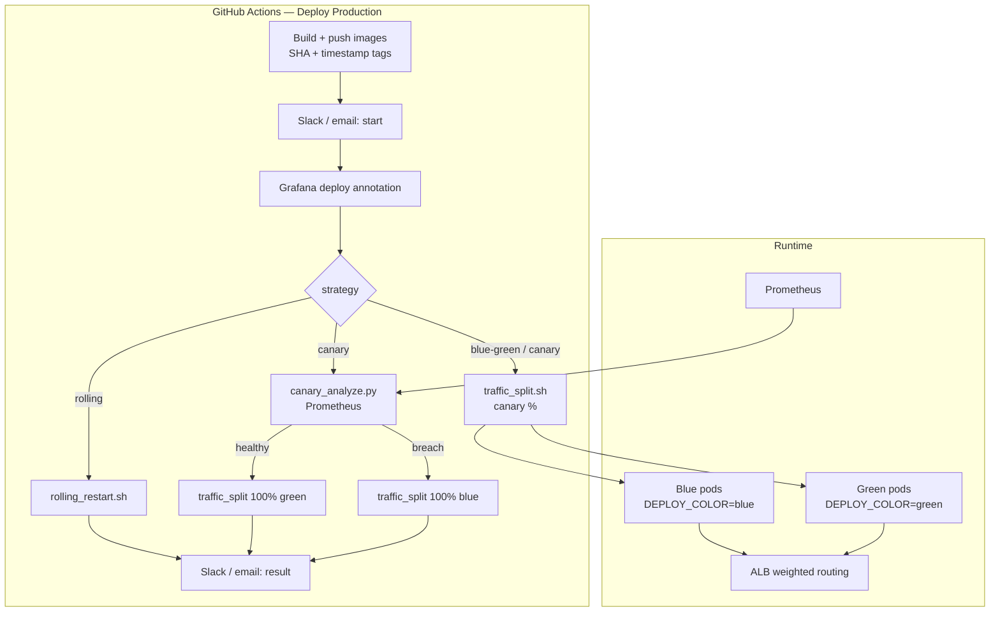

# Production deploy pipeline (plan 17.9)

## Components

| Layer | Location | Role |
|-------|----------|------|
| Workflow | `.github/workflows/deploy-production.yml` | Orchestrates build, deploy, canary, notifications |
| Scripts | `deploy/scripts/` | Rolling restart, traffic split, analysis, notify |
| Metrics | `server/internal/telemetry/` | `deploy_color` label on HTTP metrics |
| Recording rules | `deploy/observability/prometheus/recording_rules.yml` | `http_error_rate`, `http_request_duration_p95` |
| IaC | `iac/production/deploy-traffic.tf` | Canary/stable weight variables |
| K8s | `deploy/k8s/` | RollingUpdate + weighted Ingress |

## Image tagging (FR-6 / FR-8)

### Small-tier VMs (Oracle / DigitalOcean)

On every merge to `main`, `.github/workflows/publish-images.yml` pushes multi-arch (`amd64` + `arm64`):

- `ghcr.io/<org>/<repo>/server:latest` and `:git-sha>`
- `ghcr.io/<org>/<repo>/web:latest` and `:git-sha>`

Set `deploy_server_image` / `deploy_web_image` in `iac/production/terraform.tfvars` to these `:latest` tags (or pin a SHA).

### Enterprise (EKS)

Each deploy pushes:

- `ghcr.io/<org>/server-go:<git-sha>` — immutable primary tag
- `ghcr.io/<org>/server-go:<git-sha>-<timestamp>` — traceability
- Previous two SHA tags retained in GHCR for emergency rollback

## Related plans

- 17.7 — Prometheus metrics used by canary analysis
- 17.8 — `/health/ready` gates traffic
- 17.10 — backward-compatible migrations required for blue/green window
