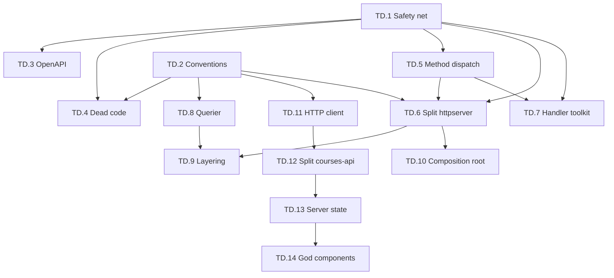

# TD — Technical Debt Remediation

> Structural remediation programme. Source: static analysis of the repository at commit `4f8a82b1` (2026-07-25). Every plan follows [`_TEMPLATE.md`](../_TEMPLATE.md).

## Prime directive

**No user-visible behaviour may change.** Every story in this folder is a *refactor* or a *deletion of proven-dead code*, with exactly one exception ([TD.3](../../completed/tech_debt/TD.3-repair-and-verify-openapi-contract.md), which repairs a confirmed shipped defect). A story is not "done" because the code looks nicer — it is done when the guardrails in [TD.1](../../completed/tech_debt/TD.1-refactoring-safety-net.md) prove the observable contract is byte-identical.

If a refactor cannot be made behaviour-preserving, **stop and re-scope**. Shipping a regression to reduce a file's line count is a net loss.

## Why this folder exists

The codebase is large and, by hygiene metrics, well-disciplined: **2 `any` casts** and **2 `@ts-expect-error`** across 1,324 TypeScript files; **1 `TODO`** and **2 `panic()`** across 1,709 non-test Go files. Test coverage is real — 802 Go test files and 262 web test files.

The debt is **not sloppiness. It is structure.** Growth went into a small number of files and packages that have passed the point where they can be reasoned about, reviewed, or safely changed:

| Symptom | Measured today |
|---|---|
| `internal/httpserver` is one flat Go package | **390** non-test files, **679** total files, **125,266** non-test LOC |
| `Deps` is the god-object every handler hangs off | **32** dependency fields, one struct |
| Route registration is one function | `registerCourseRoutes` = **455 lines**, **419** registrations |
| Repos cannot be tested without a database | **2,199** `*pgxpool.Pool` params, **0** interface abstractions |
| HTTP layer reaches past the repo layer into SQL | **58** files, **130** call sites |
| Proven-unreachable Go functions | **197** after TD.4 (was 223; golang.org/x/tools `deadcode`) |
| Unreachable in-handler method dispatch | **fixed in TD.5** — residual **7** `MethodOptions` / **40** `StatusMethodNotAllowed` (multi-method + cors/chi only); see [`docs/completed/tech_debt/TD.5-remove-unreachable-method-dispatch.md`](../../completed/tech_debt/TD.5-remove-unreachable-method-dispatch.md) |
| `/api/openapi.json` serves **invalid JSON** | **fixed in TD.3** — see [`docs/completed/tech_debt/TD.3-repair-and-verify-openapi-contract.md`](../../completed/tech_debt/TD.3-repair-and-verify-openapi-contract.md) |
| API documented vs implemented | **252** documented paths vs **1,260** unique patterns (**20%**) post-TD.3; ratchet `scripts/allowlists/openapi-coverage.txt` |
| `courses-api.ts` is a god-module | **8,631** LOC, **521** exports, imported by **215** files |
| Page components hold unmanaged state | `course-modules.tsx` **99** `useState` / 3,372 LOC; `course-module-quiz-page.tsx` **99** `useState` / 3,383 LOC |
| No server-state library | no react-query / zustand / redux — every screen hand-rolls fetch + loading + error |
| Duplicated HTTP helper | **6** byte-identical private `apiJson<T>` implementations |
| Naming convention drift | **51** files violate the kebab-case norm |

The through-line: **there is no seam.** No repo interface, no handler toolkit, no server-state layer, no module boundary. Every new feature therefore lands in the same few files, and every one of those files gets harder to change. This programme installs the seams.

## Sequencing

Phases are ordered by dependency, not by appeal. **Phase 0 is not optional** — it is what makes the rest safe.

### Phase 0 — Guardrails (must land first)

| ID | Plan | Effort | Why first |
|---|---|---|---|
| TD.1 | [Refactoring safety net](TD.1-refactoring-safety-net.md) → **done:** [`docs/completed/tech_debt/TD.1-refactoring-safety-net.md`](../../completed/tech_debt/TD.1-refactoring-safety-net.md) | M | Route-inventory + response-shape snapshots. Definition-of-done gate for every later TD story: `make route-inventory`, characterization goldens under `server/internal/httpserver/testdata/`, web export surface `clients/web/src/lib/__tests__/api-surface.test.ts`. |
| TD.2 | [Convention charter & automated enforcement](../../completed/tech_debt/TD.2-convention-charter-and-enforcement.md) → **done:** [`docs/completed/tech_debt/TD.2-convention-charter-and-enforcement.md`](../../completed/tech_debt/TD.2-convention-charter-and-enforcement.md) | S | Charter [`docs/ARCHITECTURE_CONVENTIONS.md`](../../ARCHITECTURE_CONVENTIONS.md); `make lint-structure` + allowlists under `scripts/allowlists/`. |

### Phase 1 — Confirmed defects & proven-dead code (low risk, immediate value)

| ID | Plan | Effort | Depends on |
|---|---|---|---|
| TD.3 | [Repair and verify the OpenAPI contract](../../completed/tech_debt/TD.3-repair-and-verify-openapi-contract.md) → **done** | S | TD.1 |
| TD.4 | [Delete confirmed dead code](../../completed/tech_debt/TD.4-delete-confirmed-dead-code.md) → **done** | S | TD.1, TD.2 |
| TD.5 | [Remove unreachable in-handler method dispatch](../../completed/tech_debt/TD.5-remove-unreachable-method-dispatch.md) → **done** | S | TD.1 |

### Phase 2 — Backend architecture

| ID | Plan | Effort | Depends on |
|---|---|---|---|
| TD.6 | [Decompose `internal/httpserver` into domain packages](TD.6-decompose-httpserver-package.md) | XL | TD.1, TD.2, TD.5 |
| TD.7 | [Handler toolkit: typed I/O, guards, error mapping](../../completed/tech_debt/TD.7-handler-toolkit.md) → **done** | M | TD.1, TD.5 |
| TD.8 | [`Querier` abstraction for the repo layer](TD.8-querier-abstraction-for-repos.md) | L | TD.2 |
| TD.9 | [Enforce layering: no raw DB access in the HTTP layer](TD.9-enforce-repo-layering.md) | M | TD.6, TD.8 |
| TD.10 | [Composition root: decompose `Deps` and `Config`](TD.10-composition-root-decomposition.md) | L | TD.6 |

### Phase 3 — Frontend architecture

| ID | Plan | Effort | Depends on |
|---|---|---|---|
| TD.11 | [Consolidate the web HTTP client foundation](TD.11-consolidate-http-client-foundation.md) | S | TD.2 |
| TD.12 | [Split `courses-api.ts` and the API client layer](TD.12-split-courses-api-module.md) | M | TD.11 |
| TD.13 | [Adopt server-state management](TD.13-adopt-server-state-management.md) | L | TD.11, TD.12 |
| TD.14 | [Decompose god components](TD.14-decompose-god-components.md) | XL | TD.13 |

## Dependency graph



## Working agreements

1. **One seam per PR.** A PR that both moves files and changes logic is unreviewable — and this whole programme is about reviewability. Move, or change. Never both.
2. **Pure moves must be provable.** For a file relocation, `git log --follow` must work and the diff must be import-path lines only. Reviewers should be able to verify "nothing changed" mechanically.
3. **Deletions cite their evidence.** Every removed symbol names the tool and run that proved it dead (`deadcode`, coverage, route inventory). "I couldn't find a caller" is not evidence — see [TD.4 §6](../../completed/tech_debt/TD.4-delete-confirmed-dead-code.md) for the reflection/codegen traps.
4. **The ratchet only tightens.** New budgets in [TD.2](../../completed/tech_debt/TD.2-convention-charter-and-enforcement.md) are enforced against *new and modified* code first; the backlog burns down per story. Never loosen a threshold to make CI pass.
5. **Behaviour questions beat style questions.** If review time is finite, spend it on "can this change a response?" not on naming.

## Definition of done (per story)

- [ ] Every AC in the story has at least one automated test.
- [ ] TD.1 route-inventory snapshot is unchanged, or the diff is explicitly reviewed and justified in the PR body.
- [ ] `go test ./... -count=1` and `npm run test` pass; `golangci-lint run ./...`, `npm run lint`, `npm run typecheck` clean.
- [ ] `make e2e` green.
- [ ] Any budget the story retires is enforced in CI so it cannot regress.

## Measured baseline

Captured 2026-07-25 at `4f8a82b1`. Stories track progress against these numbers; re-measure with the commands in each story's §16.

```
Go non-test files ................ 1,709      Go test files ............... 802
TS/TSX files ..................... 1,324      Web test files .............. 262
httpserver non-test LOC ....... 125,266      httpserver files (all) ...... 679
Unique registered routes ......... 1,407      Documented OpenAPI paths .... 226
Dead Go functions .................. 197      Repo pool params .......... 2,199
Raw DB call sites in httpserver .... 130      Files affected ............... 58
Web API client modules ............. 113      Duplicate apiJson impls ....... 6
e2e specs .......................... 190      Shared web hooks .............. 16
```
