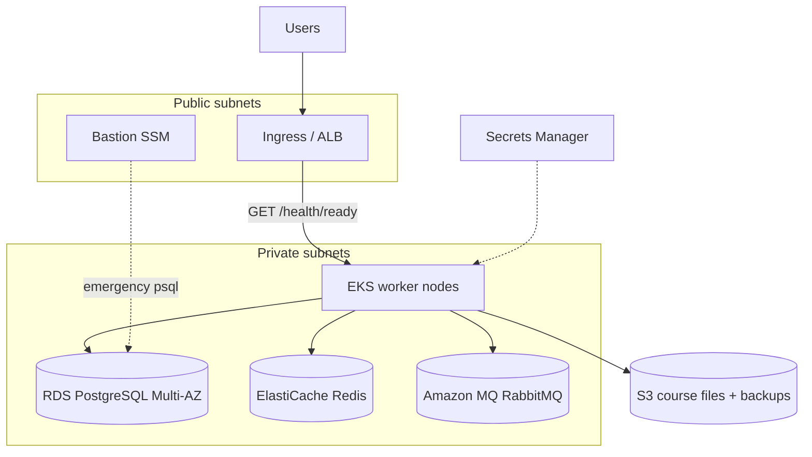

# Production infrastructure (Terraform)

Multi-cloud production IaC for Lextures. Select the target cloud with `cloud_provider`; **AWS is fully implemented** (EKS, RDS PostgreSQL, ElastiCache Redis, Amazon MQ RabbitMQ, S3, Secrets Manager). Azure and GCP directories under `iac/modules/` are reserved for future work.

The demo environment (`iac/demo/`) remains a single DigitalOcean droplet with Docker Compose and is unchanged by this stack.

## Architecture (AWS)



| Component | Service | Notes |
|-----------|---------|--------|
| Networking | VPC (3 AZ), NAT | Private subnets for workloads; public for ingress |
| Compute | Amazon EKS | Managed node group; deploy API/web via Helm/Kubernetes |
| Database | RDS PostgreSQL 16 | Private; Multi-AZ in production; 30-day backups |
| Cache | ElastiCache Redis 7 | TLS + auth token; URL in Secrets Manager |
| Job queue | Amazon MQ RabbitMQ | Private; URL in Secrets Manager |
| Object storage | S3 | Course files (`COURSE_FILES_ROOT`); IRSA role for `lextures:api` |
| Secrets | Secrets Manager | `database-url`, `redis-url`, `rabbitmq-url` ARNs exported (not values) |
| Emergency access | SSM bastion | Optional EC2 in public subnet; Postgres allowed from bastion SG only |

Sizing defaults differ for `environment = staging` vs `production` (instance classes, Multi-AZ, backup retention, Redis replica count).

## Layout

```
iac/
├── modules/
│   ├── aws/          # VPC, EKS, RDS, Redis, MQ, S3, Secrets Manager, IRSA, bastion
│   ├── azure/        # planned
│   └── gcp/          # planned
├── production/       # root module (this directory)
└── scripts/
    └── terraform-check.sh
```

## Prerequisites

- Terraform >= 1.5
- AWS credentials with permissions to create VPC, EKS, RDS, ElastiCache, Amazon MQ, S3, IAM, Secrets Manager
- Remote backend: copy `backend.tf.example` or configure HCP Terraform (see `versions.tf`)

## Quick start (AWS)

```bash
cd iac/production
cp terraform.tfvars.example terraform.tfvars
# Edit terraform.tfvars

terraform init
terraform workspace new staging   # or: production
terraform plan
terraform apply
```

Configure kubectl:

```bash
terraform output -raw kubectl_config_command | bash
```

Wire the API deployment (Helm/manifests) to:

- `database_url_secret_arn` — mount or sync as `DATABASE_URL`
- `redis_url_secret_arn` — cache / session store (17.2)
- `rabbitmq_url_secret_arn` — async job queue
- `course_files_bucket_name` + `course_files_irsa_role_arn` — annotate ServiceAccount `lextures:api`

Configure the load balancer / Ingress health check to `GET /health/ready` (see plan 17.8).

## Workspaces

Use Terraform workspaces (or separate `.tfvars`) for `staging` and `production`. Set `environment` to match the workspace so resource names and sizing stay consistent:

| Workspace | `environment` | Typical sizing |
|-----------|---------------|----------------|
| `staging` | `staging` | Single NAT, smaller RDS/Redis, no bastion by default |
| `production` | `production` | Multi-AZ RDS, Redis replica, 30-day backups, bastion enabled |

## Variables

| Variable | Description |
|----------|-------------|
| `cloud_provider` | `aws` (implemented), `azure`, `gcp` (planned) |
| `environment` | `staging` or `production` |
| `aws_region` | AWS region (data residency) |
| `enable_bastion` | SSM bastion for emergency DB access (default: on in production) |

See `variables.tf` for EKS/RDS/Redis sizing overrides.

## Runbook: Provisioning a new environment from scratch

1. Create an AWS account / IAM role for Terraform with least-privilege policies.
2. Create remote state storage (S3 + DynamoDB lock table per `backend.tf.example`, or an HCP Terraform workspace `lextures-production-aws`).
3. Copy `terraform.tfvars.example` → `terraform.tfvars`; set `environment`, `aws_region`, and tags.
4. `terraform init` → `terraform workspace select staging` → `terraform apply`.
5. Run `terraform output -raw kubectl_config_command | bash` and deploy the Lextures Helm chart / manifests.
6. Configure External Secrets Operator (or equivalent) to inject Secrets Manager ARNs into pods.
7. Point DNS at the Ingress / ALB; verify `GET /health/ready` returns 200.
8. Repeat with `environment = production` in a separate workspace after staging smoke tests.

## Runbook: Responding to Postgres failover (RDS Multi-AZ)

1. Confirm impact: check RDS events in AWS Console and `/health/ready` on app instances.
2. RDS Multi-AZ failover is automatic; wait for the primary endpoint to stabilize (typically 1–3 minutes).
3. Restart app pods if connection pools are stuck: `kubectl rollout restart deployment/lextures-api -n lextures`.
4. Verify backups: RDS automated snapshots should show a snapshot within the last 24 hours.
5. For manual investigation, connect via bastion:
   ```bash
   eval "$(terraform output -raw bastion_ssm_connect_command)"
   # On bastion: psql using credentials from Secrets Manager
   ```

## Runbook: Destroying an environment (non-production only)

1. Take a final RDS snapshot if any data must be retained.
2. Set `course_files_bucket_force_destroy = true` in staging tfvars.
3. `terraform destroy` in the staging workspace.
4. **Never** destroy production without an explicit snapshot-first procedure and stakeholder sign-off.

## CI and deployment

- Pull requests: `.github/workflows/ci.yml` runs `make iac-check` when `iac/**` changes.
- Optional plan comments: when `TF_TOKEN` and HCP Terraform workspace are configured, CI can post `terraform plan` output on PRs.
- Production apply: `.github/workflows/deploy-production.yml` — manual `workflow_dispatch` only, gated by GitHub Environment approval.

## Local validation

```bash
make iac-check
```

## Next steps (not in Terraform)

- Kubernetes manifests / Helm chart for Go API and React web
- AWS Load Balancer Controller + Ingress for public traffic (`/health/ready` health checks)
- External Secrets Operator to inject Secrets Manager values into pods
- Azure (AKS + flexible PostgreSQL + Azure Cache) and GCP (GKE + Cloud SQL + Memorystore) modules
