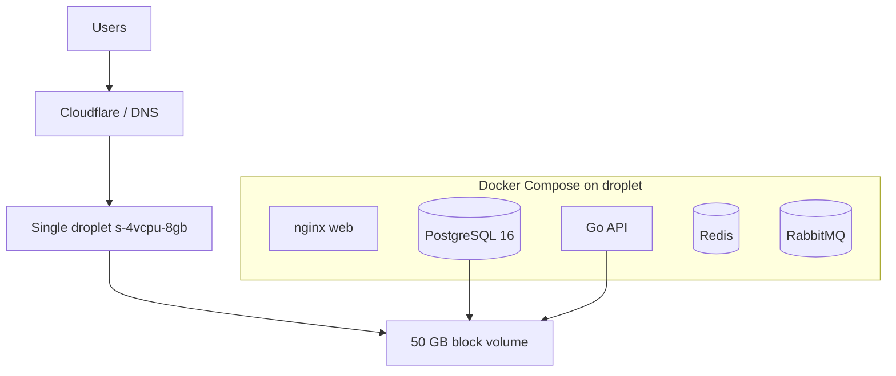
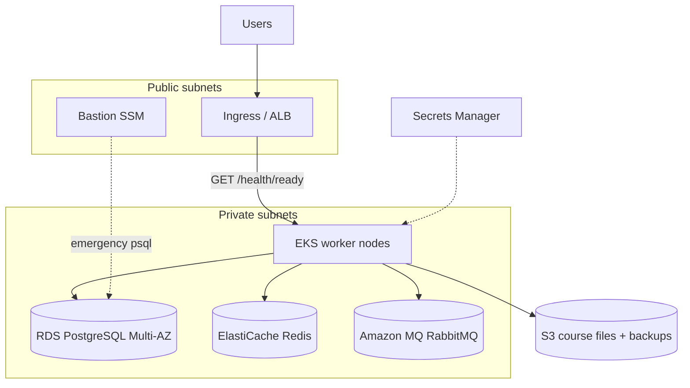

# Production infrastructure (Terraform)

Multi-cloud production IaC for Lextures. Choose a **deployment tier** that matches your scale:

| Tier | Cloud | Target load | Est. cost |
|------|-------|-------------|-----------|
| **small** | DigitalOcean | ~300 students, ~15 teachers | **~$57/mo** |
| **small** | Oracle Cloud (OCI) | ~300 students, ~15 teachers | **$0/mo** (Always Free) |
| **enterprise** | AWS | Multi-school / district, EKS + managed services | ~$900+/mo |

The demo environment (`iac/demo/`) remains a minimal DigitalOcean droplet for trials and is unchanged by this stack.

## Architecture (small tier — DigitalOcean)



| Component | Service | Notes |
|-----------|---------|--------|
| Compute | DigitalOcean droplet | 4 vCPU / 8 GB RAM default; all services via `docker-compose.deploy.yml` |
| Database | PostgreSQL 16 container | Data on attached block volume (`/mnt/lextures-db/postgres`) |
| Cache / queue | Redis + RabbitMQ containers | Co-located on the droplet |
| Object storage | Local disk on block volume | Course files at `/mnt/lextures-db/course-files` |
| Ingress | nginx on droplet :80/:443 | Terminate TLS at Cloudflare (Full) or on-box |
| Stable IP | Reserved IPv4 | ~$4/mo; use for DNS A record |

**Estimated monthly cost (list price, single region):**

| Resource | Default | ~USD/mo |
|----------|---------|---------|
| Droplet `s-4vcpu-8gb` | 4 vCPU, 8 GB RAM | $48 |
| Block volume 50 GB | Postgres + course files | $5 |
| Reserved IPv4 | DNS | $4 |
| **Total** | | **~$57** |

Optional weekly droplet backups add ~20% of droplet cost (~$10). Egress and container registry are excluded.

To reduce cost further, set `digitalocean_droplet_size = "s-2vcpu-4gb"` (~$24/mo droplet → **~$33/mo** total).

## Architecture (small tier — Oracle Cloud)

Same Docker Compose layout as DigitalOcean, on an **Ampere A1** VM (`VM.Standard.A1.Flex`, 2 OCPU / 12 GB RAM by default). Targets OCI **Always Free** in the tenancy home region.

| Component | Service | Notes |
|-----------|---------|--------|
| Compute | OCI Ampere A1 VM | 2 OCPU (≈4 Arm vCPU) / 12 GB RAM default |
| Database | PostgreSQL 16 container | Data on attached block volume (`/mnt/lextures-db/postgres`) |
| Cache / queue | Redis + RabbitMQ containers | Co-located on the VM |
| Object storage | Local disk on block volume | Course files at `/mnt/lextures-db/course-files` |
| Ingress | nginx on VM :80/:443 | Terminate TLS at Cloudflare (Full) or on-box |
| Stable IP | Reserved public IPv4 | Included; use for DNS A record |
| Images | **linux/arm64** required | A1 is Arm; build Arm container images in CI |

**Estimated monthly cost (Always Free limits):**

| Resource | Default | ~USD/mo |
|----------|---------|---------|
| A1 Flex 2 OCPU / 12 GB | Always Free compute | $0 |
| Boot 50 GB + data 100 GB | Within 200 GB block quota | $0 |
| Reserved public IP | On running instance | $0 |
| **Total** | | **$0** |

If you exceed Always Free limits or cannot obtain free capacity, paid A1 usage is still inexpensive (~$15–40/mo typical). See `iac/modules/oracle/README.md` for auth and capacity notes.

## Architecture (enterprise tier — AWS)



| Component | Service | Notes |
|-----------|---------|--------|
| Networking | VPC (3 AZ), NAT | Private subnets for workloads; public for ingress |
| Compute | Amazon EKS | Managed node group; deploy API/web via Helm/Kubernetes |
| Database | RDS PostgreSQL 16 | Private; Multi-AZ in production; 30-day backups |
| Cache | ElastiCache Redis 7 | TLS + auth token; URL in Secrets Manager |
| Job queue | Amazon MQ RabbitMQ | Private; URL in Secrets Manager |
| Object storage | S3 | Course files (`COURSE_FILES_ROOT`); IRSA role for `lextures:api` |
| Secrets | Secrets Manager | `database-url`, `redis-url`, `rabbitmq-url` ARNs exported (not values) |
| Emergency access | SSM bastion | Optional EC2 in public subnet; Postgres allowed from bastion SG only |

Sizing defaults differ for `environment = staging` vs `production` (instance classes, Multi-AZ, backup retention, Redis replica count).

## Layout

```
iac/
├── modules/
│   ├── aws/          # VPC, EKS, RDS, Redis, MQ, S3, Secrets Manager, IRSA, bastion
│   ├── digitalocean/ # Single droplet + block volume (small tier)
│   ├── oracle/       # Single OCI A1 VM + block volume (small tier)
│   ├── azure/        # planned
│   └── gcp/          # planned
├── production/       # root module (this directory)
└── scripts/
    └── terraform-check.sh
```

## Prerequisites

- Terraform >= 1.5
- **Small tier (DigitalOcean):** API token (`DIGITALOCEAN_TOKEN` env var or `digitalocean_token` variable)
- **Small tier (Oracle):** OCI API credentials in `terraform.tfvars` (`oci_tenancy_ocid`, `oci_user_ocid`, `oci_fingerprint`, `oci_private_key_path`) or `oci_auth_method = "config_file"` with `~/.oci/config`; plus `oci_compartment_id` and home region for Always Free
- **Enterprise tier:** AWS credentials with permissions to create VPC, EKS, RDS, ElastiCache, Amazon MQ, S3, IAM, Secrets Manager
- Remote backend: copy `backend.tf.example` or configure HCP Terraform (see `versions.tf`)

## Quick start (small tier — single school)

```bash
cd iac/production
cp terraform.tfvars.example terraform.tfvars
# Edit terraform.tfvars:
#   deployment_tier = "small"
#   cloud_provider  = "digitalocean"
#   environment     = "production"

export DIGITALOCEAN_TOKEN="dop_v1_..."

terraform init
terraform workspace new production
terraform plan
terraform apply
```

After apply:

```bash
# Save SSH key and connect
terraform output -raw droplet_ssh_private_key > lextures-do.pem
chmod 600 lextures-do.pem
ssh -i lextures-do.pem root@$(terraform output -raw droplet_reserved_ipv4)

# On the droplet: copy docker-compose.deploy.yml and .env, then:
docker compose -f docker-compose.deploy.yml --env-file /opt/lextures/.env up -d
```

Point DNS at `terraform output -raw droplet_reserved_ipv4`. Set `VITE_API_URL` to your public origin (e.g. `https://school.example.com`).

## Quick start (small tier — Oracle Cloud)

```bash
cd iac/production
cp terraform.tfvars.example terraform.tfvars
# Edit terraform.tfvars:
#   deployment_tier      = "small"
#   cloud_provider       = "oracle"
#   environment          = "production"
#   oci_region           = "<tenancy home region>"
#   oci_compartment_id   = "ocid1.compartment.oc1..aaaa..."
#   deploy_server_image  = "ghcr.io/<org>/<repo>/server:latest"
#   deploy_web_image     = "ghcr.io/<org>/<repo>/web:latest"
#   deploy_registry_*    = only when GHCR images are private

terraform init
terraform workspace new production
terraform plan
terraform apply
```

Cloud-init installs Docker, mounts the data volume, writes `/opt/lextures/docker-compose.deploy.yml` and `.env`, pulls images, and runs the stack. After apply (allow ~10–15 minutes on first boot):

```bash
curl -fsS "http://$(terraform output -raw droplet_reserved_ipv4)/health"
terraform output -raw deploy_postgres_password   # generated when unset in tfvars
terraform output -raw deploy_jwt_secret
```

Changing `deploy_server_image`, `deploy_web_image`, or `deploy_public_origin` replaces the compute instance so cloud-init re-runs (Postgres data persists on the block volume). To redeploy without changing images, SSH and run `sudo /usr/local/bin/lextures-deploy-app.sh`.

After apply, SSH as `ubuntu` (not `root`). Outputs are shared with the DigitalOcean small tier (`droplet_reserved_ipv4`, `deploy_compose_command`, etc.).

## Quick start (enterprise tier — AWS)

```bash
cd iac/production
cp terraform.tfvars.example terraform.tfvars
# Edit terraform.tfvars (defaults: deployment_tier = enterprise, cloud_provider = aws)

terraform init
terraform workspace new staging   # or: production
terraform plan
terraform apply
```

Configure kubectl:

```bash
terraform output -raw kubectl_config_command | bash
```

Wire the API deployment (Helm/manifests) to:

- `database_url_secret_arn` — mount or sync as `DATABASE_URL`
- `redis_url_secret_arn` — cache / session store (17.2)
- `rabbitmq_url_secret_arn` — async job queue
- `course_files_bucket_name` + `course_files_irsa_role_arn` — annotate ServiceAccount `lextures:api`

Configure the load balancer / Ingress health check to `GET /health/ready` (see plan 17.8).

## Workspaces

Use Terraform workspaces (or separate `.tfvars`) for `staging` and `production`. Set `environment` to match the workspace so resource names stay consistent:

| Workspace | `environment` | Tier | Typical sizing |
|-----------|---------------|------|----------------|
| `staging` | `staging` | enterprise | Single NAT, smaller RDS/Redis, no bastion by default |
| `production` | `production` | small | s-4vcpu-8gb droplet, 50 GB volume |
| `production` | `production` | enterprise | Multi-AZ RDS, Redis replica, 30-day backups, bastion enabled |

## Variables

| Variable | Description |
|----------|-------------|
| `deployment_tier` | `small` (DigitalOcean or Oracle) or `enterprise` (AWS) |
| `cloud_provider` | `digitalocean`, `oracle` (small), or `aws` (enterprise) |
| `environment` | `staging` or `production` |
| `digitalocean_droplet_size` | Droplet slug (default `s-4vcpu-8gb`) |
| `oci_compartment_id` | OCI compartment OCID (required for Oracle) |
| `oci_region` | OCI region — must be home region for Always Free |
| `oci_instance_ocpus` / `oci_instance_memory_gbs` | A1 sizing (default 2 / 12, Always Free max) |
| `digitalocean_data_volume_size_gb` | Block storage for Postgres + files (default 50) |
| `aws_region` | AWS region (enterprise tier) |
| `enable_bastion` | SSM bastion for emergency DB access (enterprise; default on in production) |

See `variables.tf` for full EKS/RDS/Redis sizing overrides (enterprise tier).

## Runbook: Provisioning a new environment from scratch

### Small tier (DigitalOcean or Oracle)

1. Create cloud account and credentials (DO API token or OCI `~/.oci/config`).
2. Create remote state storage (HCP Terraform workspace or local backend).
3. Copy `terraform.tfvars.example` → `terraform.tfvars`; set `deployment_tier = "small"`, `cloud_provider`, and `environment`.
4. For Oracle: set `oci_compartment_id` and `oci_region` to the tenancy **home region**.
5. `terraform init` → `terraform apply`.
6. SSH to the VM; deploy with `docker-compose.deploy.yml` (Arm64 images for Oracle).
7. Point DNS at `droplet_reserved_ipv4`; verify `GET /health/ready` returns 200.

### Enterprise tier

1. Create an AWS account / IAM role for Terraform with least-privilege policies.
2. Create remote state storage (S3 + DynamoDB lock table per `backend.tf.example`, or an HCP Terraform workspace `lextures-production-aws`).
3. Copy `terraform.tfvars.example` → `terraform.tfvars`; set `deployment_tier = "enterprise"`, `environment`, `aws_region`, and tags.
4. `terraform init` → `terraform workspace select staging` → `terraform apply`.
5. Run `terraform output -raw kubectl_config_command | bash` and deploy the Lextures Helm chart / manifests.
6. Configure External Secrets Operator (or equivalent) to inject Secrets Manager ARNs into pods.
7. Point DNS at the Ingress / ALB; verify `GET /health/ready` returns 200.
8. Repeat with `environment = production` in a separate workspace after staging smoke tests.

## Runbook: Responding to Postgres failover (RDS Multi-AZ)

Enterprise tier only.

1. Confirm impact: check RDS events in AWS Console and `/health/ready` on app instances.
2. RDS Multi-AZ failover is automatic; wait for the primary endpoint to stabilize (typically 1–3 minutes).
3. Restart app pods if connection pools are stuck: `kubectl rollout restart deployment/lextures-api -n lextures`.
4. Verify backups: RDS automated snapshots should show a snapshot within the last 24 hours.
5. For manual investigation, connect via bastion:
   ```bash
   eval "$(terraform output -raw bastion_ssm_connect_command)"
   # On bastion: psql using credentials from Secrets Manager
   ```

## Runbook: Destroying an environment (non-production only)

1. Take a final database backup if any data must be retained (pg_dump on small tier; RDS snapshot on enterprise).
2. **Enterprise:** Set `course_files_bucket_force_destroy = true` in staging tfvars.
3. `terraform destroy` in the staging workspace.
4. **Never** destroy production without an explicit backup-first procedure and stakeholder sign-off.

## CI and deployment

- Pull requests: `.github/workflows/ci.yml` runs `make iac-check` when `iac/**` changes, canary unit tests and zero-downtime rolling-restart validation when `deploy/**` changes.
- Optional plan comments: when `TF_TOKEN` and HCP Terraform workspace are configured, CI can post `terraform plan` output on PRs.
- Production deploy: `.github/workflows/deploy-production.yml` — manual `workflow_dispatch` with `rolling`, `blue-green`, or `canary` strategies (plan 17.9). Gated by GitHub Environment approval. **Targets enterprise (AWS/EKS) deployments.**
- Traffic weights: `iac/production/deploy-traffic.tf` variables `deploy_canary_weight` / `deploy_stable_weight`, applied via `deploy/scripts/traffic_split.sh`.

## Local validation

```bash
make iac-check
```

## Next steps (not in Terraform)

- **Small tier:** CI/CD to push images and run `docker compose` on the droplet (similar to demo deploy workflow)
- **Enterprise tier:** Kubernetes manifests / Helm chart for Go API and React web
- AWS Load Balancer Controller + Ingress for public traffic (`/health/ready` health checks)
- External Secrets Operator to inject Secrets Manager values into pods
- Azure (AKS + flexible PostgreSQL + Azure Cache) and GCP (GKE + Cloud SQL + Memorystore) modules
