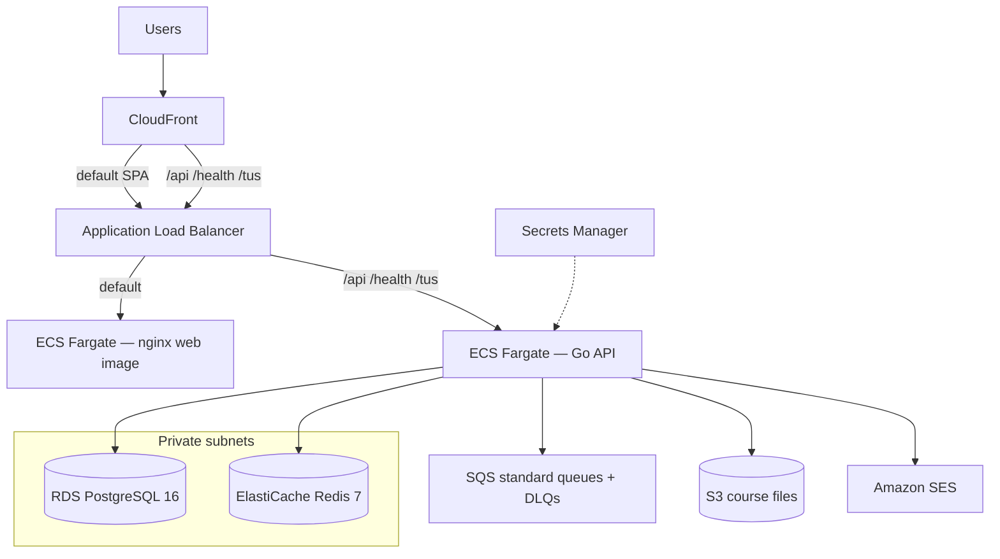

# AWS self-host stack (`iac/self-aws`)

Managed AWS infrastructure for Lextures that **does not** co-locate Postgres, Redis, and RabbitMQ in Docker on a single EC2/VM. This is the production self-host path (Fargate + managed data plane).

## Architecture



| Concern | AWS service | Cost notes |
|---------|-------------|------------|
| **Web (SPA)** | **ECS Fargate** (`web_image`) + ALB, or **S3** when `web_image` is empty | Prefer the GHCR web image from `publish-images` |
| **API** | **ECS Fargate** + ALB | CloudFront proxies `/api/*` (and ALB path-routes when web is on Fargate) |
| CDN | **CloudFront** | HTTPS + optional custom domain; default origin is ALB when `web_image` is set |
| Database | **RDS PostgreSQL 16** (`db.t4g.micro` default) | Free-tier eligible size; single-AZ |
| Cache | **ElastiCache Redis 7** (`cache.t3.micro` default) | Free-tier eligible size; single node; TLS + auth |
| Queues | **SQS** (4 queues + DLQs) | Always Free: 1M requests/month |
| Email | **Amazon SES** (when `ses_domain` is set) | Pay per send; sandbox until production access |
| Files | **S3** (course files) | SSE-S3; IAM task role |
| Secrets | **Secrets Manager** | `DATABASE_URL`, `REDIS_URL`, JWT, SQS URLs, storage; optional registry pull auth |

Default networking places Fargate tasks in **public subnets with public IPs** so a NAT gateway is not required (~$32/mo savings). RDS and Redis stay private. Set `enable_nat_gateway = true` for private-subnet tasks.

### Web image vs static S3

- **Preferred:** set `web_image` (e.g. `ghcr.io/<org>/<repo>/web:latest` from `.github/workflows/publish-images.yml`). Terraform runs nginx on Fargate; ALB path-routes API vs SPA. CloudFront’s default origin is the ALB.
- **Legacy / offline build:** leave `web_image` empty and run `scripts/deploy-web.sh` to build Vite and sync `clients/web/dist` to S3. CloudFront serves S3 and only proxies API paths to the ALB.

Build the SPA (image or static) with **empty `VITE_API_URL`** so the browser uses same-origin (`window.location.origin`). The published web image already does this.

ALB path patterns for the API: `/api/*`, `/health`, `/health/*`, `/tus/*`. The nginx image’s built-in reverse proxy to Docker hostname `server` is **not** used on Fargate; the ALB owns that routing.

### Deploying new versions

**CI (recommended):** [`.github/workflows/deploy-self-aws.yml`](../../.github/workflows/deploy-self-aws.yml) runs after [Publish container images](../../.github/workflows/publish-images.yml) succeeds on `main`. It applies this module with immutable `server_image` / `web_image` tags `ghcr.io/<org>/<repo>/{server,web}:<git-sha>`, which updates ECS task definitions and rolls the services. Manual runs: **Actions → Deploy Self AWS → Run workflow**.

Repository secrets: `TF_TOKEN`, `TF_CLOUD_ORGANIZATION`. AWS credentials, optional GHCR pull credentials (`registry_username` / `registry_password`), optional `bootstrap_admin_email`, and SES domain settings belong in the HCP workspace `lextures-self-aws-production` — use a long-lived PAT for private packages, not `GITHUB_TOKEN` (it expires and would be stored in Secrets Manager).

**Local / force redeploy** after images are already in the registry:

```bash
# Roll the nginx SPA (force-new-deployment pulls the tag in web_image)
./iac/self-aws/scripts/deploy-web.sh

# Roll the Go API
./iac/self-aws/scripts/deploy-api.sh
```

To pin a new immutable tag manually, change `server_image` / `web_image` in `terraform.tfvars` (or HCP vars) and `terraform apply` (creates new task definitions). With `:latest`, the force-deploy scripts above re-pull after a registry push.

If `web_image` is empty, `deploy-web.sh` falls back to build + S3 sync + CloudFront invalidation.

## Prerequisites

- Terraform >= 1.5
- AWS credentials with permission to create VPC, RDS, ElastiCache, SQS, S3, SES, CloudFront, ECS, ALB, IAM, Secrets Manager, CloudWatch Logs
- Container images for the **API** and (recommended) **web** when `enable_ecs = true`
- For **private** GHCR packages: `registry_username` + `registry_password` (PAT with `read:packages`)
- For SES: a domain you control (DKIM CNAMEs) and, for open sending, SES production access (out of sandbox)
- Node.js + npm only if using the static S3 path (`web_image` empty)

## Quick start

```bash
cd iac/self-aws
cp terraform.tfvars.example terraform.tfvars
# Edit region, server_image, web_image, optional public_web_origin / custom domain

terraform init
terraform plan
terraform apply

# Roll tasks after images are in the registry (or after changing :latest contents)
./scripts/deploy-web.sh
./scripts/deploy-api.sh
```

Data plane only (no ALB/ECS/CloudFront API proxy yet):

```hcl
enable_ecs         = false
enable_static_site = true   # can still host a built SPA on S3
```

Then enable the app:

```hcl
enable_ecs     = true
server_image   = "ghcr.io/YOUR_ORG/lextures/server:latest"
web_image      = "ghcr.io/YOUR_ORG/lextures/web:latest"
# registry_username / registry_password if GHCR packages are private
```

Custom domain (optional). Without `web_domain_names`, CloudFront serves HTTPS on `*.cloudfront.net` automatically.

**Terraform-managed cert (recommended):** set only the domain list — no certificate UUID needed.

```hcl
web_domain_names  = ["beta.example.com"]
public_web_origin = "https://beta.example.com"
# web_acm_certificate_arn left empty → ACM cert created in us-east-1
```

1. Set `web_domain_names` (and `public_web_origin`) in HCP or tfvars.
2. Preferred first apply (creates the cert without waiting forever on DNS):
   ```bash
   cd iac/self-aws
   terraform apply -target=aws_acm_certificate.web
   terraform output acm_dns_validation_records
   ```
3. Create each record as a **CNAME** in Cloudflare (**DNS only** / grey cloud).
4. Full apply (validates cert, attaches it to CloudFront):
   ```bash
   terraform apply
   ```
5. Point the site CNAME: `beta` → CloudFront domain (`terraform output cloudfront_domain_name`), also **DNS only**.

Keep the apex/`self` record **DNS only** (grey cloud). Proxied Cloudflare in front of CloudFront double-caches responses; during an ECS roll a brief `/assets/*` 404 can be stored for a year when the origin sends long `Cache-Control`, which shows up as unstyled pages (CSS/JS URLs returning HTML). If that happens, purge Cloudflare for `/assets/*` (and hard-refresh the browser) after the web tasks are healthy.

A full apply without the validation CNAMEs in place waits up to **45 minutes** for ACM issuance and then fails if DNS is still missing.

**Existing cert:** set `web_acm_certificate_arn` to a real us-east-1 ACM ARN instead of leaving it empty.

### Amazon SES (transactional email)

When `enable_ses = true` and `ses_domain` is set (e.g. `lextures.com`):

1. Terraform creates a **domain identity**, a **configuration set**, and an **IAM policy** on the ECS task role (`ses:SendEmail` / `ses:SendRawEmail` scoped to that domain).
2. The API task gets:
   - `EMAIL_PROVIDER=ses`
   - `SES_REGION` (stack region)
   - `SES_FROM` (`ses_from_email`, or `no-reply@<ses_domain>`)
   - `SES_CONFIGURATION_SET`
   - empty `SES_ACCESS_KEY_ID` / `SES_SECRET_ACCESS_KEY` (task role credentials)
3. Publish DNS from `terraform output ses_dns_records` (Easy DKIM CNAMEs; optional custom MAIL FROM if `ses_mail_from_subdomain` is set). Use **DNS only** in Cloudflare.
4. New SES accounts are in the **sandbox** (verified recipients only) until you request production access in the SES console.
5. In the app, enable **Settings → Global platform → Amazon SES** (`ffEmailSes`). The API only uses SES when that flag is on **and** `EMAIL_PROVIDER=ses` (the latter is set by Terraform when SES resources exist).

```hcl
enable_ses     = true
ses_domain     = "example.com"
ses_from_email = "no-reply@example.com"
# ses_mail_from_subdomain = "bounce"  # optional
```

Leave `ses_domain` empty to skip SES resources (API keeps default SMTP until you configure email in Settings).

## Application configuration

Secrets Manager secret `${project}-${environment}/app` is a JSON object. ECS injects keys as environment variables:

| Key | Purpose |
|-----|---------|
| `DATABASE_URL` | RDS (`sslmode=require`) |
| `REDIS_URL` | ElastiCache (`rediss://` TLS + auth) |
| `JWT_SECRET` | Auth signing |
| `QUEUE_BACKEND` | `sqs` |
| `SQS_*_URL` | Per-queue SQS URLs |
| `STORAGE_BACKEND` | `s3` |
| `STORAGE_BUCKET` / `STORAGE_REGION` | Course files |

Plain environment variables (not secrets) when SES is enabled: `EMAIL_PROVIDER`, `SES_REGION`, `SES_FROM`, `SES_CONFIGURATION_SET`.

`PUBLIC_WEB_ORIGIN` on the API task defaults to the CloudFront HTTPS URL (or `public_web_origin` when set).

`BOOTSTRAP_ADMIN_EMAIL` comes from Terraform variable `bootstrap_admin_email` (HCP workspace or `terraform.tfvars`). When non-empty, the **first** password signup whose email matches (trimmed, lowercased) gets Global Admin if no human users exist yet. Leave empty and use `go run ./cmd/bootstrap-admin -email=…` against RDS to promote an account after the fact.

Local dev remains unchanged (`RABBITMQ_URL`, SMTP or unset email, local Vite, etc.).

## App code notes

- Queues: `server/internal/mq` (RabbitMQ **or** SQS by URL scheme); config via `QUEUE_BACKEND` + `SQS_*_URL`
- Email: `server/internal/mail` SES provider (`EMAIL_PROVIDER=ses`); credentials via task role unless static keys are set
- Postgres-backed job queue (ADR 0001) is unchanged

## Estimated monthly cost (ballpark, us-east-1)

| Resource | ~USD/mo |
|----------|---------|
| RDS `db.t4g.micro` single-AZ 20 GB | ~$12–15 (often $0 in free tier year 1) |
| ElastiCache `cache.t3.micro` | ~$12 (often $0 in free tier year 1) |
| SQS | ~$0 at modest volume |
| SES | ~$0.10 / 1k emails after free tier |
| S3 (optional web bucket + course files) | storage + requests (often <$2 early) |
| CloudFront | free tier 1 TB / 10M requests (year 1), then usage |
| ALB | ~$16+ |
| Fargate API 0.5 vCPU / 1 GB × 1 | ~$15–25 |
| Fargate web 0.25 vCPU / 0.5 GB × 1 | ~$8–12 |
| NAT (optional) | ~$32 |
| **Typical lean total (no NAT, web + API on Fargate)** | **~$65–85** (lower during free tier) |

## Outputs

```bash
terraform output cloudfront_domain_name
terraform output web_bucket
terraform output alb_dns_name
terraform output ecs_cluster_name
terraform output ecs_web_service_name
terraform output ecs_api_service_name
terraform output -raw database_url   # sensitive
terraform output sqs_queue_urls
terraform output course_files_bucket
terraform output app_secret_arn
terraform output ses_dns_records
terraform output ses_from_email
```
