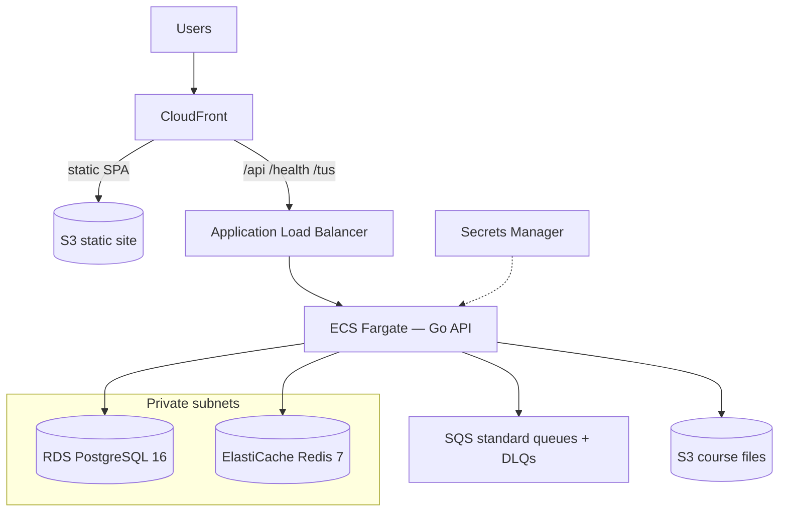

# AWS self-host stack (`iac/self-aws`)

Managed AWS infrastructure for Lextures that **does not** co-locate Postgres, Redis, and RabbitMQ in Docker on a single EC2/VM.

This directory is **independent of Oracle Cloud** (`iac/self` + `iac/modules/oracle`). Applying here does not touch OCI resources.

## Architecture



| Concern | AWS service | Cost notes |
|---------|-------------|------------|
| **Web (SPA)** | **S3 + CloudFront** | Static Vite build; no Fargate for nginx |
| **API** | **ECS Fargate** + ALB | API only; CloudFront proxies `/api/*` for same-origin |
| Database | **RDS PostgreSQL 16** (`db.t4g.micro` default) | Free-tier eligible size; single-AZ |
| Cache | **ElastiCache Redis 7** (`cache.t3.micro` default) | Free-tier eligible size; single node; TLS + auth |
| Queues | **SQS** (4 queues + DLQs) | Always Free: 1M requests/month |
| Files | **S3** (course files) | SSE-S3; IAM task role |
| Secrets | **Secrets Manager** | `DATABASE_URL`, `REDIS_URL`, JWT, SQS URLs, storage |

Default networking places Fargate API tasks in **public subnets with public IPs** so a NAT gateway is not required (~$32/mo savings). RDS and Redis stay private. Set `enable_nat_gateway = true` for private-subnet tasks.

### Static web vs API

- Build the SPA with **empty `VITE_API_URL`** so the browser uses same-origin (`window.location.origin`).
- CloudFront serves `index.html` / assets from S3 and forwards `/api/*`, `/health`, `/health/*`, `/tus/*` to the ALB.
- SPA client-side routes work via CloudFront custom error responses (403/404 → `/index.html`).

Deploy the web app after `terraform apply`:

```bash
./iac/self-aws/scripts/deploy-web.sh
```

## Prerequisites

- Terraform >= 1.5
- AWS credentials with permission to create VPC, RDS, ElastiCache, SQS, S3, CloudFront, ECS, ALB, IAM, Secrets Manager, CloudWatch Logs
- Container image for the **API only** (when `enable_ecs = true`)
- Node.js + npm to build `clients/web` for static deploy

## Quick start

```bash
cd iac/self-aws
cp terraform.tfvars.example terraform.tfvars
# Edit region, server_image, optional public_web_origin / custom domain

terraform init
terraform plan
terraform apply

# Build + upload SPA
../self-aws/scripts/deploy-web.sh   # or: ./scripts/deploy-web.sh from this dir
```

Data plane only (no ALB/ECS/CloudFront API proxy yet):

```hcl
enable_ecs         = false
enable_static_site = true   # can still host a built SPA
```

Then enable the API:

```hcl
enable_ecs     = true
server_image   = "ghcr.io/YOUR_ORG/lextures/server:latest"
```

Custom domain (optional). Without these, CloudFront serves HTTPS on `*.cloudfront.net` automatically:

```hcl
# 1) Create/validate cert in ACM in us-east-1 (CloudFront requirement)
# 2) Paste the real ARN (12-digit account ID + certificate UUID):
web_domain_names        = ["app.example.com"]
web_acm_certificate_arn = "arn:aws:acm:us-east-1:123456789012:certificate/aaaaaaaa-bbbb-cccc-dddd-eeeeeeeeeeee"
public_web_origin       = "https://app.example.com"
```

## Application configuration

Secrets Manager secret `${project}-${environment}/app` is a JSON object. ECS injects keys as environment variables:

| Key | Purpose |
|-----|---------|
| `DATABASE_URL` | RDS (`sslmode=require`) |
| `REDIS_URL` | ElastiCache (`rediss://` TLS + auth) |
| `JWT_SECRET` | Auth signing |
| `QUEUE_BACKEND` | `sqs` |
| `SQS_*_URL` | Per-queue SQS URLs |
| `STORAGE_BACKEND` | `s3` |
| `STORAGE_BUCKET` / `STORAGE_REGION` | Course files |

`PUBLIC_WEB_ORIGIN` on the API task defaults to the CloudFront HTTPS URL (or `public_web_origin` when set).

Local / Oracle dev remains unchanged (`RABBITMQ_URL`, local Vite, etc.).

## App code changes (SQS)

- Shared transport: `server/internal/mq` (RabbitMQ **or** SQS by URL scheme)
- Queue packages use that transport; config via `QUEUE_BACKEND` + `SQS_*_URL`
- Postgres-backed job queue (ADR 0001) is unchanged

## Estimated monthly cost (ballpark, us-east-1)

| Resource | ~USD/mo |
|----------|---------|
| RDS `db.t4g.micro` single-AZ 20 GB | ~$12–15 (often $0 in free tier year 1) |
| ElastiCache `cache.t3.micro` | ~$12 (often $0 in free tier year 1) |
| SQS | ~$0 at modest volume |
| S3 (web + course files) | storage + requests (often <$2 early) |
| CloudFront | free tier 1 TB / 10M requests (year 1), then usage |
| ALB | ~$16+ |
| Fargate API 0.5 vCPU / 1 GB × 1 | ~$15–25 |
| NAT (optional) | ~$32 |
| **Typical lean total (no NAT, static web)** | **~$55–70** (lower during free tier) |

## Migration notes (Oracle → AWS)

1. Apply this stack (data plane first is fine).
2. Dump OCI Postgres → restore into RDS.
3. Sync course files into the course-files S3 bucket; deploy the SPA with `scripts/deploy-web.sh`.
4. Point DNS at CloudFront (`cloudfront_domain_name` or custom alias); set `public_web_origin` if needed.
5. Leave the Oracle stack running until cutover validation is complete — **no resources here modify OCI**.

## Outputs

```bash
terraform output cloudfront_domain_name
terraform output web_bucket
terraform output alb_dns_name
terraform output -raw database_url   # sensitive
terraform output sqs_queue_urls
terraform output course_files_bucket
terraform output app_secret_arn
```
