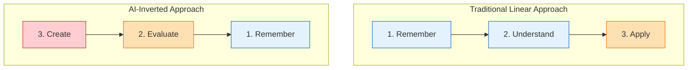
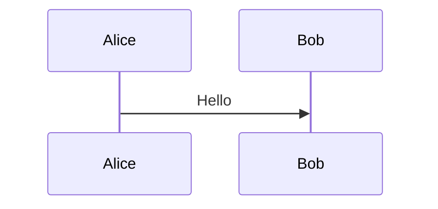

A comparison of two sequences.

```mermaid
graph TD
    subgraph "Traditional Linear Approach"
        T1[1. Remember] --> T2[2. Understand] --> T3[3. Apply]
        style T1 fill:#e3f2fd,stroke:#1565c0
        style T2 fill:#e3f2fd,stroke:#1565c0
        style T3 fill:#ffe0b2,stroke:#ef6c00
    end

    subgraph "AI-Inverted Approach"
        I3[3. Create] --> I2[2. Evaluate] --> I1[1. Remember]
        style I3 fill:#ffcdd2,stroke:#c62828
        style I2 fill:#ffe0b2,stroke:#ef6c00
        style I1 fill:#e3f2fd,stroke:#1565c0
    end
```

Unsupported mermaid stays as source:

```mermaid
sequenceDiagram
    Alice->>Bob: Hello
```
