## The Traditional Ascent

In 1956, Benjamin Bloom and a committee of educators introduced a classification of educational learning objectives that would define modern pedagogy: the Taxonomy of Educational Objectives. Revised in 2001 by Lorin Anderson and David Krathwohl, the taxonomy organized cognitive operations into a hierarchical pyramid:

1. **Remember:** Retrieve, recall, or recognize relevant knowledge from long-term memory.
2. **Understand:** Construct meaning from oral, written, and graphic messages through interpreting, exemplifying, classifying, summarizing, inferring, comparing, and explaining.
3. **Apply:** Carry out or use a procedure in a given situation.
4. **Analyze:** Break material into constituent parts, determining how the parts relate to one another and to an overall structure or purpose.
5. **Evaluate:** Make judgments based on criteria and standards through critiquing and monitoring.
6. **Create:** Put elements together to form a coherent or functional whole; reorganize elements into a new pattern or structure.

For seventy years, the consensus of instructional design has been linear: **you must walk before you can run.** A student cannot analyze a Shakespearean sonnet (Level 4) without first remembering the definition of iambic pentameter (Level 1) and understanding its rhythm (Level 2). Consequently, the vast majority of classroom time and homework in both K-12 and higher education has been spent consolidating the foundation—climbing the bottom half of the pyramid.

Then came generative AI.

## The Commoditization of the Base

The core disruption of Large Language Models (LLMs) is not that they are "smart," but that they have digitized and scaled the bottom three tiers of Bloom's Taxonomy. 

* **Remembering** is now a zero-latency query. An LLM possesses immediate access to an unmatched corpus of historical dates, mathematical formulas, syntax structures, and scientific consensus.
* **Understanding** is commoditized. Ask a frontier model to "explain quantum computing to an 8-year-old," "summarize the key arguments of Karl Marx," or "classify these clinical symptoms," and it will produce a highly coherent response in seconds.
* **Applying** is automated. Standard procedural applications—writing a basic Python script, drafting a legal contract template, or solving standard chemistry equations—no longer require manual human execution to be produced.

If a student can offload Remembering, Understanding, and Applying to an AI assistant with a simple prompt, the traditional linear model of learning collapses. If we continue to assess students primarily on these lower-order tasks, we are no longer measuring human learning; we are measuring their ability to act as an API bridge to an LLM.

As we argued in our post on [Rethinking Assessment](./rethinking-assessment-in-the-ai-era.md), detection is a dead end. We cannot police our way back to the pre-AI era. Instead, we must change the cognitive sequence of the classroom. We must **flip the pyramid.**

```mermaid
graph TD
    subgraph "Traditional Linear Approach"
        T1[1. Remember] --> T2[2. Understand] --> T3[3. Apply] --> T4[4. Analyze] --> T5[5. Evaluate] --> T6[6. Create]
        style T1 fill:#e3f2fd,stroke:#1565c0
        style T2 fill:#e3f2fd,stroke:#1565c0
        style T3 fill:#e3f2fd,stroke:#1565c0
        style T4 fill:#ffe0b2,stroke:#ef6c00
        style T5 fill:#ffe0b2,stroke:#ef6c00
        style T6 fill:#ffcdd2,stroke:#c62828
    end
    
    subgraph "AI-Inverted Approach"
        I6[6. Create - Co-Generation] --> I5[5. Evaluate - Critique & Verify] --> I4[4. Analyze - Deconstruct & Trace] --> I3[3. Apply - Contextual Transfer] --> I2[2. Understand - Internalize Patterns] --> I1[1. Remember - Active Retrieval]
        style I6 fill:#ffcdd2,stroke:#c62828
        style I5 fill:#ffe0b2,stroke:#ef6c00
        style I4 fill:#ffe0b2,stroke:#ef6c00
        style I3 fill:#e3f2fd,stroke:#1565c0
        style I2 fill:#e3f2fd,stroke:#1565c0
        style I1 fill:#e3f2fd,stroke:#1565c0
    end
```

## The Inverted Flow: Synthesis as the Starting Point

In the inverted model of Bloom's Taxonomy, the learning journey does not end with synthesis; it *begins* there. 

Instead of spending weeks memorizing facts and writing introductory paragraphs, the learner uses AI to generate draft artifacts, models, or solutions immediately. The human cognitive work is shifted upward, focusing on **Evaluation, Analysis, and Refinement**.

### 1. Co-Generation (Creating) as Step One
In a flipped workflow, the student acts as a director rather than a scribe. They prompt the AI to generate a first draft, a piece of code, or a proposed solution to a complex problem. By starting at the "Create" level, the student is exposed to a holistic, finished product immediately, bypassing the blank-page paralysis that often stalls novice learners.

### 2. Critique and Verification (Evaluating)
Once the artifact is generated, the student's primary task is evaluation. They must interrogate the output:
* *Where is the AI hallucinating or oversimplifying?*
* *What biases or unstated assumptions are embedded in its argument?*
* *Does the generated code actually run, and is it optimized for edge cases?*

This requires the student to hold the AI's output against rigorous external standards, forcing them to engage deeply with evaluative criteria.

### 3. Deconstruction and Lineage (Analyzing)
To evaluate the output effectively, the student must deconstruct it. They must analyze how the parts of the generated text or system relate to one another. They trace the logical steps the AI took, looking for flaws in the chain of reasoning.

### 4. Contextual Transfer (Applying)
The student takes the critique and applies it to modify the artifact, adapting it to a highly specific, local, or novel context that the AI's general training data could not anticipate. This is where authentic human agency is injected into the project.

### 5. Internalization and Retention (Understanding & Remembering)
Here is the crucial cognitive pivot: **the lower-order skills are not abandoned; they are acquired retrospectively.** 

Through the intense process of critiquing, analyzing, and refining the AI's output, the student builds a strong mental model of the domain. They *understand* the concepts because they have wrestled with their specific failure modes in the AI's output. They *remember* the facts because those facts were the precise keys needed to unlock and correct the AI's mistakes.

## The Cognitive Science of Flipped Bloom's

This inversion is not just a pragmatic adjustment to technology; it aligns with foundational principles of cognitive science.

### The Expertise Reversal Effect
Cognitive Load Theory, formulated by John Sweller, describes the **Expertise Reversal Effect**: instructional techniques (like highly structured, step-by-step scaffolding) that are highly effective for novices can become ineffective or even detrimental as learners gain expertise. 

For a novice, starting with a blank slate and trying to write an entire essay induces high *extraneous cognitive load*—their working memory is overwhelmed by spelling, grammar, and sentence structure, leaving no resources for deep conceptual thinking. By using AI to handle the lower-level cognitive load, we can guide novice students through high-level conceptual relationships sooner, bootstrapping their schema development.

### The Generation Effect and Active Recall
In our previous discussion on [The Synthetic Renaissance](./the-synthetic-renaissance.md), we noted the danger of cognitive offloading: when students passively consume AI-generated answers, they bypass the **"Generation Effect"**—the cognitive phenomenon where self-generated information is retained far better than passive consumption.

Flipping Bloom's Taxonomy preserves the Generation Effect by shifting the "generation" from *writing raw sentences* to *generating critiques, justifications, and corrections*. The student is not passively reading the AI's output; they are actively editing, restructuring, and arguing with it. The mental effort is concentrated on the delta between the AI's draft and the final, human-refined masterpiece.

## Operationalizing the Flipped Classroom

How do instructors design courses for this inverted flow? Here are three concrete pedagogical strategies:

### 1. The "Reverse Gradebook" Assignment (Focus: Evaluation)
Instead of asking students to write an essay on a historical topic, the instructor provides three AI-generated essays on the subject—one that is highly accurate but surface-level, one that contains subtle factual inaccuracies, and one that suffers from severe logical flaws. 
* **The Task:** Students must act as the professor, annotating the essays, grading them against a detailed [analytic rubric](./effective-rubrics-in-the-age-of-ai.md), and writing a comprehensive critique explaining *why* they awarded those grades.
* **The Learning:** To spot the subtle inaccuracies and logical flaws, students must deeply research the topic, achieving "Remembering" and "Understanding" through the act of critique.

### 2. Multi-Turn Prompt Engineering (Focus: Analysis & Application)
In computer science or writing courses, students are graded not on their final code or prose, but on their **prompt log**.
* **The Task:** Students must submit a step-by-step history of their interaction with the LLM. They must document:
  1. Their initial prompt.
  2. Their analysis of the AI's first attempt.
  3. The specific corrective prompts they used to refine the output.
  4. A final reflection on the limitations of the resulting artifact.
* **The Learning:** This shifts the grade from the product to the process, measuring the student's metacognitive monitoring and analytical precision.

### 3. The Local Synthesis Project (Focus: Creation & Transfer)
Students use AI to generate a general, theoretical framework for solving a problem (e.g., municipal water management, public relations crisis response, or lesson planning).
* **The Task:** Students must take this abstract framework and apply it to a highly specific, local community scenario (e.g., water quality in their university's town, a specific local business, or a neurodivergent student in a local classroom). They must conduct interviews, collect local data, and modify the AI framework to fit the messy reality of the physical world.
* **The Learning:** This requires far transfer—a classic sign of true cognitive mastery—and demands authentic, situated human intelligence that LLMs cannot emulate.

## Conclusion: Elevating the Ceiling of Education

The commoditization of lower-order thinking is terrifying only if we view education as a system for producing compliant informational processors. If our goal is to train students to act as human calculators or database retrievers, then generative AI has indeed rendered that goal obsolete.

But if we view education as the cultivation of critical, independent, and creative thinkers, then the inversion of Bloom's Taxonomy represents an unprecedented opportunity. By offloading the mechanical, rote, and repetitive aspects of cognitive labor to machines, we can raise the ceiling of what is possible in the classroom.

We no longer have to spend 80% of a semester climbing the bottom of the pyramid, leaving only the final two weeks for genuine, creative analysis. In the AI era, we can live at the top of the pyramid from day one.

---

*Further reading: Anderson, L. W., & Krathwohl, D. R. (2001). "A Taxonomy for Learning, Teaching, and Assessing: A Revision of Bloom's Taxonomy of Educational Objectives"; Sweller, J. (2010). "Element Interactivity and Intrinsic, Extraneous, and Germane Cognitive Load"; Wiliam, D. (2011). "What is Assessment for Learning?".*
